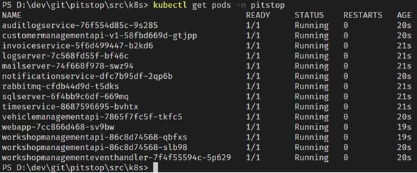
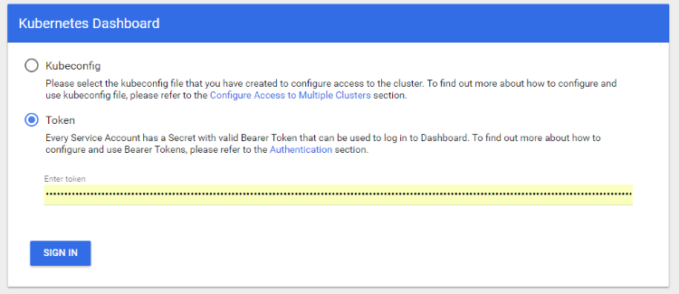
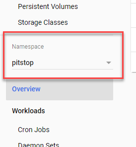

# Pitstop - Garage Management System

This repo contains a sample application based on a Garage Management System for Pitstop - a fictitious garage / car repair shop. The primary goal of this sample is to demonstrate several software-architecture concepts like:  

- Microservices  
- CQRS  
- Event Sourcing  
- Domain Driven Design (DDD)  
- Eventual Consistency  

and how to use container-technologies like:

- Docker
- Kubernetes
- Istio (service-mesh)
- Linkerd (service-mesh)

See [the Wiki for this repository](https://github.com/EdwinVW/pitstop/wiki "Pitstop Wiki") for more information about the solution and instructions on how to build, run and test the application using Docker-compose and Kubernetes.

## Table of Contents

- [Pitstop - Garage Management System](#pitstop---garage-management-system)
  - [Table of Contents](#table-of-contents)
  - [Architecture](#architecture)
    - [PitStop Web App](#pitstop-web-app)
    - [Customer Management Service](#customer-management-service)
    - [Vehicle Management Service](#vehicle-management-service)
    - [Workshop Management Service](#workshop-management-service)
    - [Notification Service](#notification-service)
    - [Invoice Service](#invoice-service)
    - [Time Service](#time-service)
    - [Auditlog Service](#auditlog-service)
  - [Run the application using Kubernetes](#run-the-application-using-kubernetes)
    - [Checking the status of the application](#checking-the-status-of-the-application)
  - [Kubernetes Dashboard](#kubernetes-dashboard)
    - [Install the dashboard](#install-the-dashboard)
    - [Access the dashboard](#access-the-dashboard)
  - [Stopping the application](#stopping-the-application)


## Architecture

Here are the architecture of the solutions.


### PitStop Web App

The web application is the front-end for the system. Users can manage customers, vehicles and the planning for the workshop from this front-end. The front-end will only communicate with the different APIs in the system and has no knowledge of the message-broker or any other services.

### Customer Management Service

This service offers an API that is used to manage Customers in the system. For now, only CREATE and READ functionality (list and single by unique Id) is implemented.

This service handles the following commands:

- RegisterCustomer

This service publishes the following events:

- CustomerRegistered

### Vehicle Management Service

This service offers an API that is used to manage Vehicles in the system. For now, only CREATE and READ functionality (list and single by unique Id) is implemented.

This service handles the following commands:

- RegisterVehicle

This service publishes the following events:

- VehicleRegistered

### Workshop Management Service

This service contains 2 parts: an API for managing the workshop planning and an event-handler that handles events and builds a read-model that is used by the API.

### Notification Service

The notification service sends a notification to every customer that has a maintenance job planned on the current day. It only handles events from the message-broker and offers no API.

This service handles the following events:

- CustomerRegistered
- DayHasPassed
- MaintenanceJobPlanned
- MaintenanceJobFinished

### Invoice Service

The invoice service creates an invoice for all maintenance jobs that have been finished (and are not yet invoiced). It only handles events from the message-broker and offers no API. The invoice is created as an HTML email message which is emailed to PrestoPrint, a fictitious printing company.

This service handles the following events:

- CustomerRegistered
- DayHasPassed
- MaintenanceJobPlanned
- MaintenanceJobFinished

### Time Service

The Time service is a service that informs other services when a certain time-period has passed. For now only the DayHasPassed event is supported.

I chose this approach to make testing of time-related functionality simple without the need for messing with the system-clock on test-machines. So instead of acting upon time-outs based on the system-time, services act upon events.

This service publishes the following events:

- DayHasPassed

### Auditlog Service

The AuditLog service picks up all events from the message-broker and stores them for later reference. It only handles events from the message-broker and offers no API.

## Run the application using Kubernetes

This will describe how to run the Pitstop solution using Kubernetes.

> This description assumes you have basic knowledge of Kubernetes concepts. It will help to understand what's going on if you're familiar with things like: nodes, deployments, pods, services, replica-sets and namespaces. If this is not the case, check-out the Kubernetes documentation to learn about these concepts before continuing with this description.

Execute the following steps to start the application:

- Make sure your have satisfied the Prerequisites (also for Kubernetes) and you have built all the Docker images as described in Building the Docker images. You can also pull the images from the Pitstop repo available in Docker Hub.
- Open up a Powershell window and go to the Pitstop/src/k8s folder.
- Issue the following command:

```bash
start-all.ps1 -nomesh
```

on Windows or

```bash
start-all.sh --nomesh
```

on Linux. This will start the solution.

> Pitstop can also be run with a service-mesh. The *nomesh* switch indicates you want to run Pitstop on Kubernetes without any service-mesh. If you want to know, see Run the application using a service-mesh.

The start-all script uses the Kubernetes CLI (kubectl) to apply the following Kubernetes config files:

| Config file | Description |
|:-|:-|
| pitstop-namespace.yaml | Creates the pitstop namespace |
| rabbitmq.yaml | Creates the RabbitMQ deployment |
| logserver.yaml | Creates the Seq deployment |
| sqlserver.yaml | Creates the SQL Server deployment |
| mailserver.yaml | Creates the Mailserver deployment |
| invoiceservice.yaml | Creates the InvoiceService deployment |
| timeservice.yaml | Creates the TimeService deployment |
| notificationservice.yaml | Creates the NotificationService deployment |
| workshopmanagementeventhandler.yaml | Creates the WorkshopManagementEventHandler deployment |
| auditlogservice.yaml | Creates the AuditLogService deployment |
| customermanagementapi-v1.yaml | Creates the CustomerManagement v1 deployment |
| customermanagementapi-v2.yaml | Creates the CustomerManagement v2 deployment |
| customermanagementapi-svc.yaml | Creates the CustomerManagement service |
| vehiclemanagementapi.yaml | Creates the VehicleManagement deployment and service |
| workshopmanagementapi.yaml | Creates the WorkshopManagement deployment and service |
| webapp.yaml | Creates the WebApp deployment and service |

### Checking the status of the application

You can check whether or not the application was started successfully using the Kubernetes CLI. Execute the following command: `kubectl get pods -n pitstop`. This will show you an overview of all the pods that are started in the Pitstop namespace. You should see something like this:



It could take some time for pods to get up & running so you could see some other statuses in the list.

Next steps:

- Follow the steps described in [Testing the application](Testing%20the%20application) to test the application functionality.
- See [Logging](Logging "Logging") to learn how to get to the application logging.
- In the logging you might see some errors during start-up. See [Resiliency](Resiliency "Resiliency") to learn where these errors are coming from.

## Kubernetes Dashboard

You can get a deep insight into what's running on the Kubernetes cluster by using the Kubernetes dashboard. In order to view this dashboard, you first need to install it on the cluster. This is a one-time activity.

### Install the dashboard

Execute the following steps to install the dasboard:

- Install the dashboard components on the Kubernetes cluster:

   ```bash
   kubectl apply -f https://raw.githubusercontent.com/kubernetes/dashboard/v2.2.0/aio/deploy/recommended.yaml
   ```

- Create an admin user for accessing the dashboard:

   ```bash
   kubectl apply -f .\dashboard-adminuser.yaml
   ```

- Retrieve the list of secrets installed in the cluster:

   ```bash
   kubectl -n kube-system get secret
   ```

- Find the secret with the name that starts with `admin-user-token-` and copy the entire name.
- Get information about this secret:

   ```bash
   kubectl -n kube-system describe secret admin-user-token-?????
   ```

   The output should look something like this:

  

- Copy the token in the output to the clipboard and save it somewhere. You need this every time you access the dashboard to authenticate.

### Access the dashboard

- Make sure the dashboard is accessible on localhost:

   ```bash
   kubectl proxy
   ```

- Open the dashboard in a browser: [`http://localhost:8001/api/v1/namespaces/kubernetes-dashboard/services/https:kubernetes-dashboard:/proxy/`](http://localhost:8001/api/v1/namespaces/kubernetes-dashboard/services/https:kubernetes-dashboard:/proxy/).
- When not authenticated, the dashboard will ask you to authenticate yourself. You can do this by using the token (see installation steps above):

  

- If you want to inspect the Pitstop components running on the cluster, make sure you select the *Pitstop* namespace in the dashboard:

  

## Stopping the application

To stop all the Pitstop components, execute the script `stop-all.ps1` or `stop-all.sh`. This script will use kubectl to delete all the Pitstop components from the cluster. Give all the pods some time to terminate. You can check whether or not everything has been deleted by getting all components in the Pitstop namespace: `kubectl get pods -n pitstop`.
